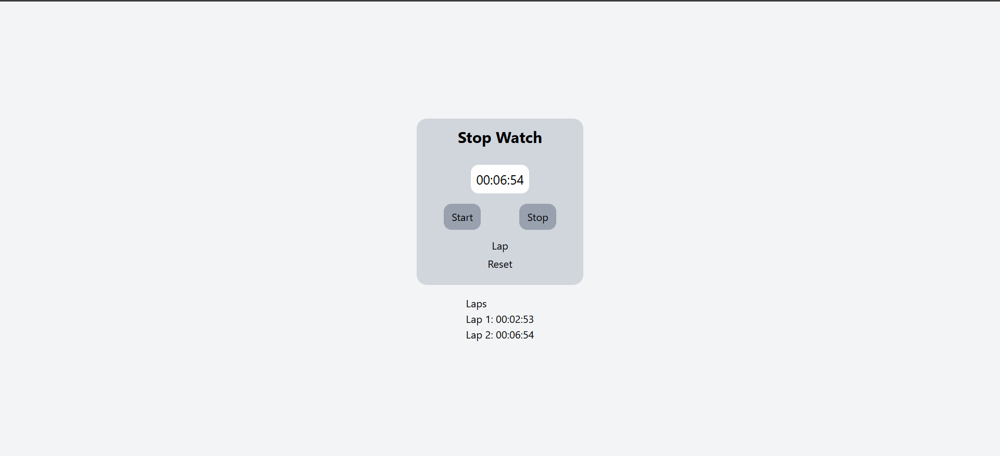
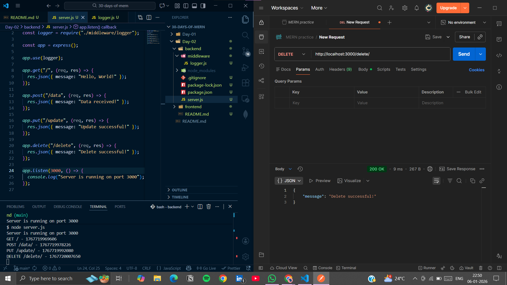

# Day 02: Digital Timer & Logger Middleware

## 🏁 Goal

**Frontend:** Build a stopwatch with Start, Stop, and Lap features.
**Backend:** Write a middleware that logs the method, URL, and time for every request.

## 🛠 Tech Stack

- **Frontend:** React, Vite
- **Backend:** Node.js, Express

## 📝 Learning Outcomes

- Using React Hooks (useState, useEffect, useRef) for time-based logic.
- Safely handling intervals and state updates.
- Implementing lap functionality in a stopwatch.
- Understanding Express middleware and request lifecycle.
- Logging request method, URL, and timestamp using custom middleware.

## 📸 Screenshots





## 🏃‍♂️ How to Run

**Backend:**

```bash
cd backend
npm install
node index.js
```

**Frontend**

```bash
cd frontend
npm install
npm run dev
```
