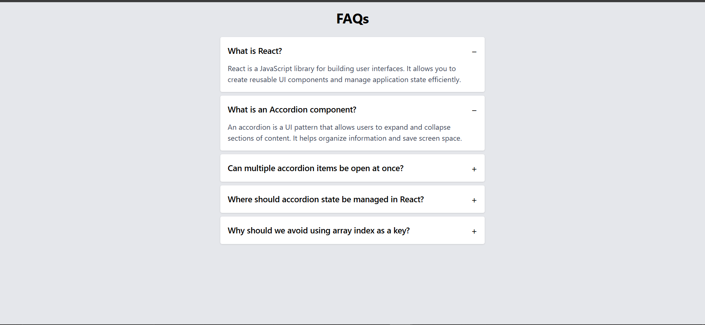
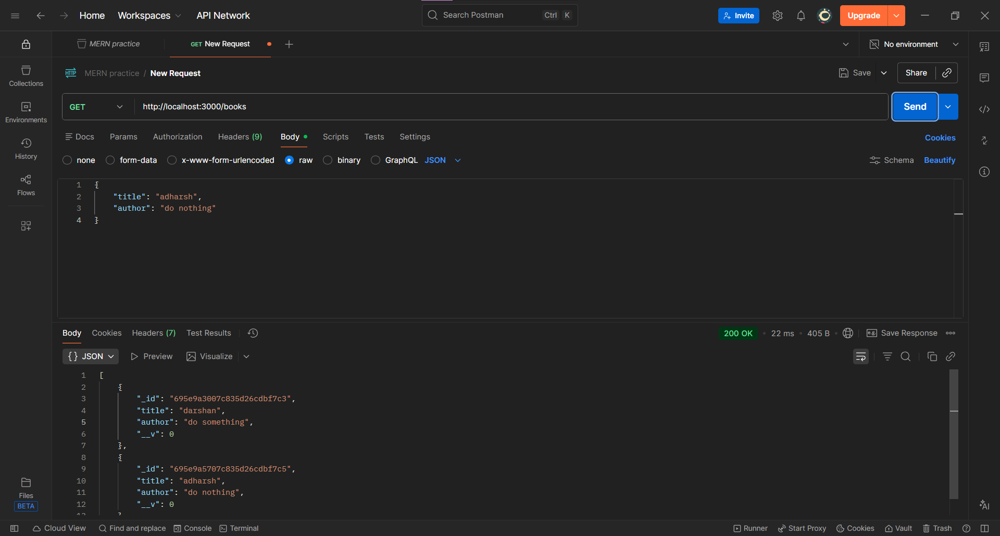

# Day 03: Accordian & CRUD API(Creat/Read)

## 🏁 Goal

**Frontend:** Build a reusable accordion that supports "allow multiple open" mode.
**Backend:** Create schemas and endpoints for Create/Read a Book.

## 🛠 Tech Stack

- **Frontend:** React, Vite
- **Backend:** Node.js, Express

## 📝 Learning Outcomes

- Building reusable and controlled components in React.
- Managing shared state to support multiple UI interactions.
- Implementing toggle logic for expandable accordion items.
- Designing RESTful APIs using Express and MongoDB.
- Creating and fetching data using Mongoose schemas and models.

## 📸 Screenshots





## 🏃‍♂️ How to Run

**Backend:**

```bash
cd backend
npm install
node server.js
```

**Frontend**

```bash
cd frontend
npm install
npm run dev
```
