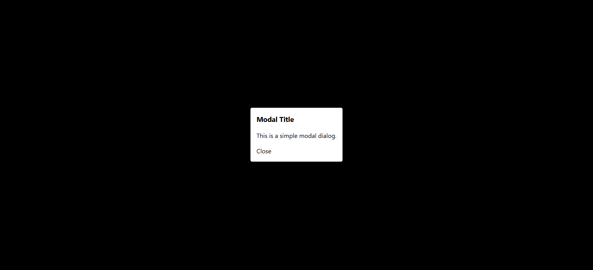
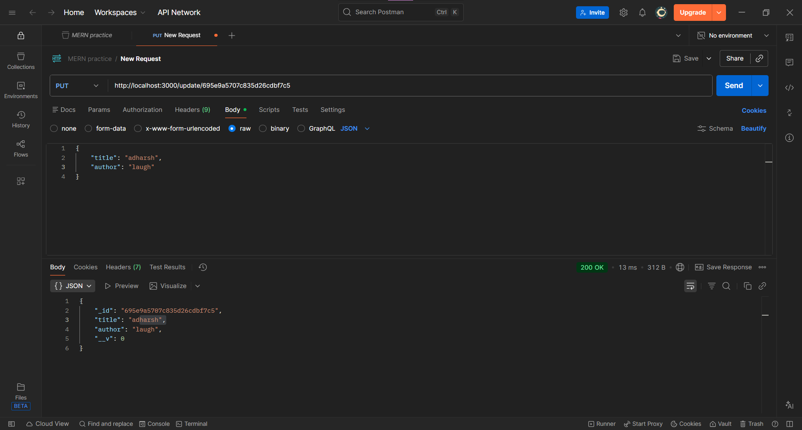

# Day 04: Custom useModal & CRUD API

## 🏁 Goal

**Frontend:** Build a modal accessible via a custom hook useModal
**Backend:** Create schemas and endpoints for CRUD a Book.

## 🛠 Tech Stack

- **Frontend:** React, Vite
- **Backend:** Node.js, Express

## 📝 Learning Outcomes

- Building custom hooks in React.
- Implementing backdrop to colapse modal.
- Designing RESTful APIs using Express and MongoDB.
- Creating, fetching, updating and deleting data using Mongoose schemas and models.

## 📸 Screenshots







## 🏃‍♂️ How to Run

**Backend:**

```bash
cd backend
npm install
node server.js
```

**Frontend**

```bash
cd frontend
npm install
npm run dev
```
